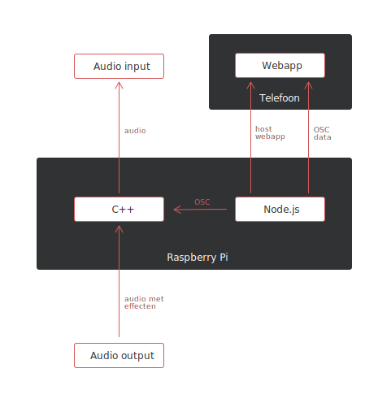
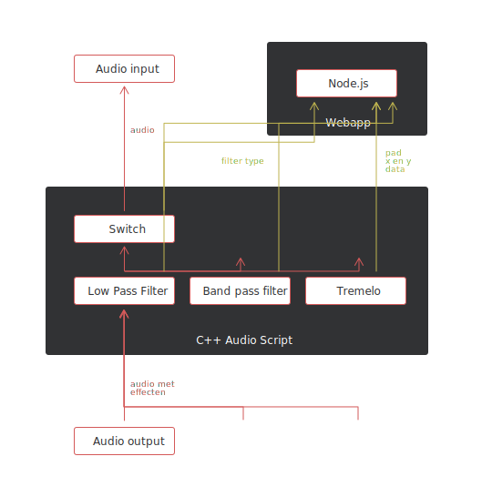

# CSD2C
Eindopdracht van Bas de Bruin en Ruben Middelman.

## Conceptbeschrijving

Wij hebben voor dit project gekozen voor een draadloze aansturing van effecten via mobiele telefoon. De uitvoering hiervan is geïnspireerd door de KORG KAOSS PAD effect-dozen.
Een computer of raspberry pi host een web app die je kan openen op je telefoon. Hierop krijg je een XY pad en een aantal knoppen te zien waarmee je kan wisselen tussen effecten.
De data van de telefoon wordt via OSC naar een C++ script gestuurd die de effecten, realtime op de inkomende audio uitvoert.
De effect keuze is ook geïnspireerd door de KAOSS pad en bestaat uit de keuze tussen: een lowpass filter, bandpass filter en tremolo.
Voor de UI van de webapp is een combinatie van p5.js en html elementen gebruikt.

## Systeemdiagram

## Audio Flow Diagram

## Tijdsbesteding