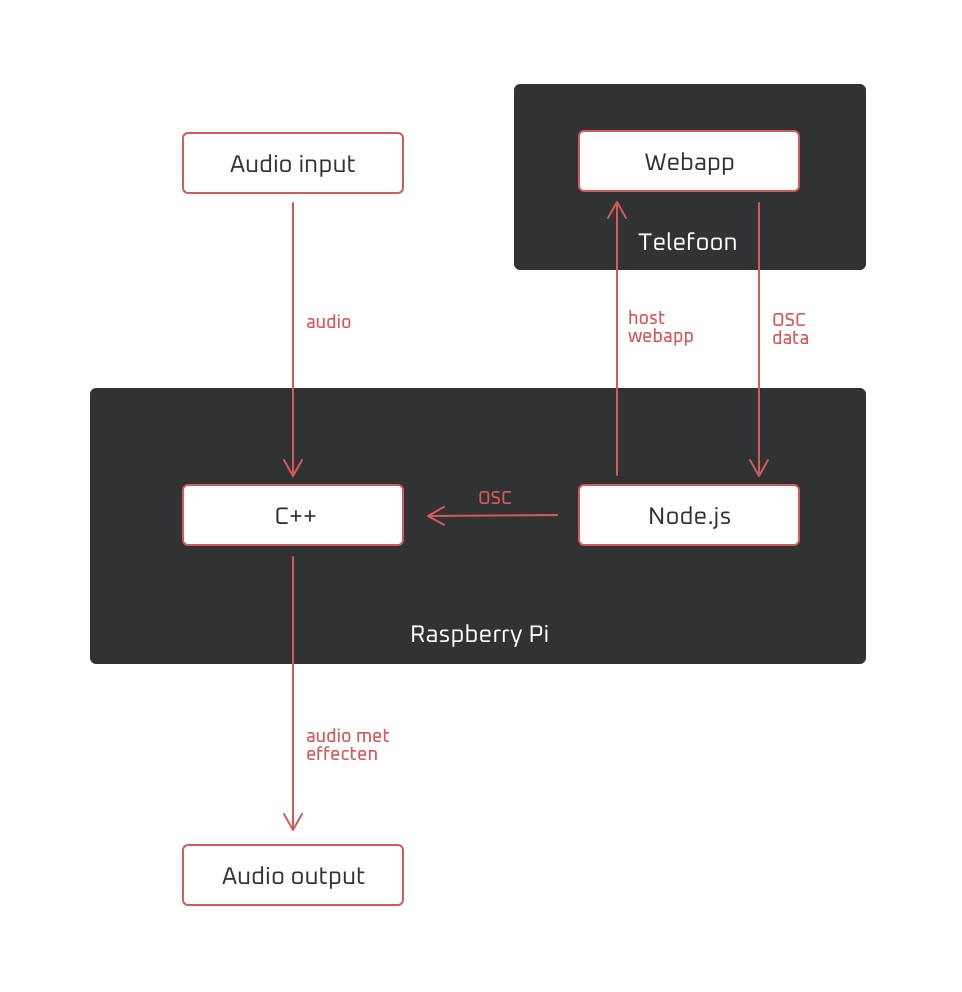
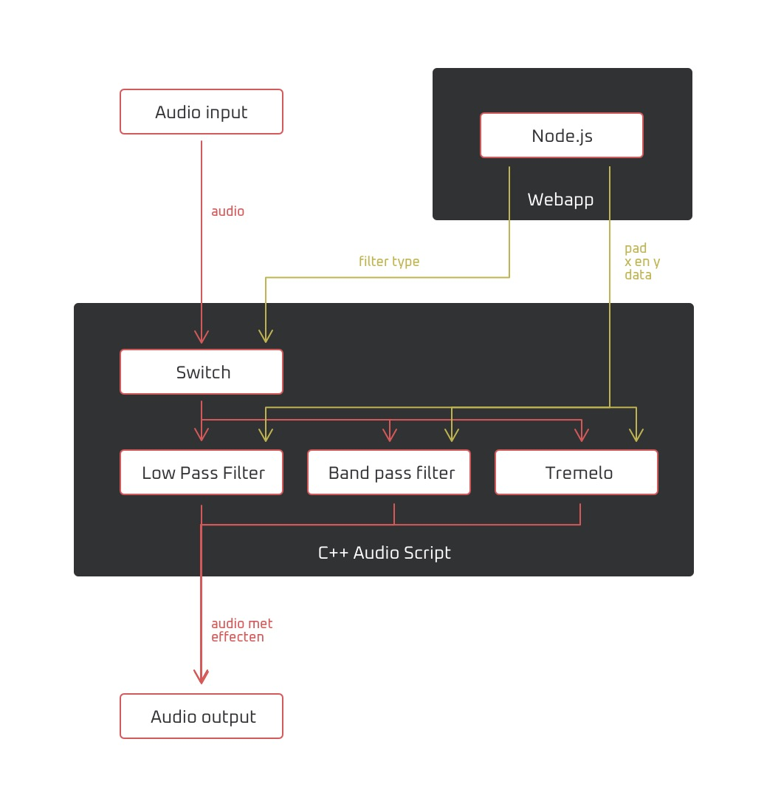

# CSD2C
Eindopdracht van Bas de Bruin en Ruben Middelman.

## Conceptbeschrijving

Wij hebben voor dit project gekozen voor een draadloze aansturing van effecten via mobiele telefoon. De uitvoering hiervan is geïnspireerd door de KORG KAOSS PAD effect-dozen.
Een computer of raspberry pi host een web app die je kan openen op je telefoon. Hierop krijg je een XY pad en een aantal knoppen te zien waarmee je kan wisselen tussen effecten.
De data van de telefoon wordt via OSC naar een C++ script gestuurd die de effecten, realtime op de inkomende audio uitvoert.
De effect keuze is ook geïnspireerd door de KAOSS pad en bestaat uit de keuze tussen: een lowpass filter, bandpass filter en tremolo.
Voor de UI van de webapp is een combinatie van p5.js en html elementen gebruikt.

## Systeemdiagram

## Audio Flow Diagram

## Reflectie

#### Bas
Naar mijn mening ging dit project redelijk goed. We zijn tegen wat problemen gelopen maar die hebben we ook opgelost.
Mijn samenwerking met Ruben ging goed, we hebben een duidelijke taakverdeling gemaakt en het werkt eerlijk verdeeld, ik had met meer op het low-pass filter, webapp en documentatie gericht en Ruben op de osc en audio processing code.

Als enige kritiek aan dit project heb ik dat ik een beetje teleurgesteld was is de hoeveelheid vrijheid die we kregen. Het voelde nog erg als een school opdracht waar je een idee moet verzinnen om de eisen van de opdracht heen. Ons project was dan ook een beetje een idee voor een app wat we om hebben gevormt naar de eisen. Desalnietemin was het een leerzame ervaring en ben ik tevreden met het eindresultaat.

#### Ruben

## Tijdsbesteding

#### Bas
* 10 uur - Webapp code
* 5 uur - Low-pass filter
* 3 uur - Documentatie
* 5 uur - Demovideo + editing
